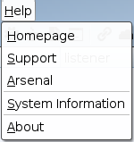

# CS简介

>Cobalt Strike是一款美国Red Team开发的渗透测试神器，常被业界人称为CS。

Cobalt Strike是一款由java编写的全平台多方协同渗透测试框架，在3.0版本之前它基于Metasploit框架工作，在3.0后的版本以独立成一个渗透测试平台。它分为客户端与服务端，服务端只有一个并运行在linux中，客户端可以有多个，可被团队进行分布式协团操作。本篇文章讲解的是4.0版本的使用。

Cobalt Strike集成了端口转发、扫描多模式端口Listener、socket代理、提权、钓鱼、远控木马Windows exe程序生成、Windows dll动态链接库生成、java程序生成、office宏代码生成，包括站点克隆获取浏览器的相关信息等功能。该工具几乎覆盖了APT攻击链中所需要用到的各个技术环节，且其最大的优点在于可以进行团队合作和优越的UI界面。

Cobalt Strike是一个c/s架构，他被分配作为客户端并连接到团队服务器。团队服务器是Cobalt Strike的一部分用来与目标环境做交互。

  >团队成员需要知道
	>>- 服务端的外部IP地址
	>>- 连接服务端的密码
	>>- 团队成员上线同一个服务端，会在团队成员内
	>>- 使用相同的会话
	>>- 分享靶机数据
	>>- 通过一个共享的事件日志交流
	
# CS的安装

Strategic Cyber 责任有限公司发行了适用于 Windows、Linux 和 MacOS X 的 Cobalt Strike 软件包。**要安装 Cobalt Strike，只需将其存档解压到你的操作系统上。**
* 系统要求
	 Cobalt Strike 要求 Oracle Java 1.8，Oracle Java 11, 或 OpenJDK 11，kali系统自带JAVA环境，也可自行删除重装JDK。
	 
	如果你的系统上装有防病毒产品，请确保在安装 Cobalt Strike 前将其禁用。

**英文版：https://pan.baidu.com/s/1M8VJE9J7BHFh-SLitMtZkw 密码: b3ju
汉化版：https://pan.baidu.com/s/1iElxAMg5jiXtUgjmNwLlog  密码:45ih**  

	./update
运行 更新 程序
	Cobalt Strike 发emphasized text行套件包含 Cobalt Strike 启动器、支持文件和更新程序。它不包含 Cobalt Strike 程序本身。你必须运行更新程序才能下载 Cobalt Strike 产品。

打开文件目录

CobaltStrike一些主要文件功能如下：

	· agscript：扩展应用的脚本
	
	· c2lint：用于检查profile的错误和异常
	
	· teamserver：服务器端启动程序
	
	· cobaltstrike.jar：CobaltStrike核心程序
	
	· cobaltstrike.auth：用于客户端和服务器端认证的文件，客户端和服务端有一个一模一样的
	
	· cobaltstrike.store：秘钥证书存放文件	

一些目录作用如下： 

	· data：用于保存当前TeamServer的一些数据

	· download：用于存放在目标机器下载的数据

	· logs：日志文件，包括Web日志、Beacon日志、截图日志、下载日志、键盘记录日志等

	· third-party：第三方工具目录

	· Scripts： 插件目录

# CS 的登录
## 团队服务器

Cobalt Strike 分为客户端组件和服务器组件。服务器组件，也就是团队服务器，是 Beacon payload 的控制器，也是 Cobalt Strike 社会工程功能的托管主机。团队服务器还存储由 Cobalt Strike 收集的数据，并管理日志记录。

Cobalt Strike 团队服务器必须在受支持的 Linux 系统上运行。要启动一个 Cobalt Strike 团队服务器，使用 Cobalt Strike Linux 安装包中的 teamserver 脚本文件。

***启动服务端***
		
		./teamserver  192.168.12.135 123456
>#该ip地址为团队服务器IP，而后是连接服务器的密码
>注意：cs默认监听端口为50050，可以打开teamserver文件，修改端口。

当团队服务器启动，它会发布团队服务器的 SSL证书的 SHA256 hash。你需要给你的团队成员分发这个hash。当你的团队成员连接团队服务器时，在身份验证至团队服务器前、他们的Cobalt Strike 客户端会询问他们是否承认这个 hash 。这是抵御中间人攻击的重要保护措施。

## 客户端

客户端可以在任意操作系统中运行，需要配置Jdk的环境。

***启动客户端***

	./start.sh
>HOST 为服务器的IP地址
>PORT 为端口号 （默认即可）
>USER 为用户名 （默认即可）
>Password 为登录密码 （服务端密码）

	
按下 Connect 按钮来连接到 Cobalt Strike 的团队服务器。
如果这是你第一次连接此团队服务器，Cobalt Strike 会询问你是否承认这个团队服务器的 SHA256hash。如果你承认，那么按 OK，然后 Cobalt Strike 的客户端就会连接到这个团队服务器。Cobalt Strike 也会在未来的连接中记住这个 SHA256 hash。你可以通过 Cobalt Strike→ Preferences → Fingerprints 来管理这些团队服务器的 hash。

	

### 用户接口

>Cobalt Strike 用户接口分为两部分。接口的顶部是会话或目标的视觉化展示。接口的底部展示了每个你与之交互的 Cobalt Strike 功能或会话的标签页。你可以点击这两部分之间的区域、按你的喜好重新调整这两个区域的大小。

- Cobalt Strike 顶部的工具条提供访问 Cobalt Strike 常用功能的快捷方式。熟悉此工具条按钮会提升你使用 Cobalt Strike 的效率。

>CobaltStrike模块
>· New Connection：新建连接窗口
>· Preferences：偏好设置，设置CobaltStrike外观的
>· Visualization：将主机以不同的权限展示出来(主要以输出结果展示)
>· VPN Interfaces：设置VPN接口
>· Listeners：创建监听器
>· Script Interfaces：查看和加载CNA脚本
>· Close：关闭
>

> VIew模块
> · Applications：显示受害者主机的应用信息
> · Credentials：显示受害主机的凭证信息
> · Downloads：查看从受害主机上下载的文件
> · Event Log：主机上线记录以及团队协作聊天记录
> · Keystrokes：查看键盘记录
> · Proxy Pivots：查看代理模块
> · Screenshots：查看屏幕截图
> · Script Console：加载第三方脚本以增强功能
> · Targets：查看所有受害主机
> · Web Log：查看web日志
> 

>Attacks模块
> Packages：
> · HTML Application:生成(executable/VBA/powershell)这三种原理实现的恶意木马文件
> · MS Office Macro:生成office宏病毒文件
> · Payload Generator:生成各种语言版本的payload
> · Windows Executable:生成可执行exe木马
> · Windows Executable(S):生成无状态的可执行exe木马
> 
> 
>Web Drive-by:
>· Manage:对开启的web服务进行管理
>·Clone Site:克隆网站，记录受害者提交的数据
>· Host File: 提供文件下载，可以选择Mime类型
>· Scripted Web Delivery:为payload提供web服务以便下载和执行，类似于Metasploit的web_delivery
>· Signed Applet Attack:使用java自签名的程序进行钓鱼攻击(该方法已过时)
>· Smart Applet Attack: 自动检测java版本并进行攻击，针对Java 1.6.0_45以下以及Java 1.7.0_21以下版本(该方法已过时)
>· System Profiler:用来获取系统信息，如系统版本，Flash版本，浏览器版本等
>

>Reporting模块
>· Activity Report:活动报告
>· Hosts Report:主机报告
>· Indicators of Compromise:IOC报告：包括C2配置文件的流量分析、域名、IP和上传文件的MD5 hashes
>· Sessions Report:会话报告
>· Social Engineering Report:社会工程报告：包括鱼叉钓鱼邮件及点击记录
>· Tactics, Techniques, and Procedures:战术技术及相关程序报告：包括行动对应的每种战术的检测策略和缓解策略
>· Reset Data:重置数据
>· Export Data: 导出数据，导出.tsv文件格式
>

>Help模块
>· Homepage:官方主页 
>· Support:技术支持 
>· Arsenal:开发者 
>· System information:版本信息 
>· About:关于
>

# CS的使用
## 1.使用 Event log 进行聊天
	View->Event Log
会显示连接团队服务器的成员，可进行聊天

## 2.创建监听器Listener
>任何行动的第一步都是建立基础设施。就Cobalt Strike而言，基础设施由一个或多个团队服务器、重定向器以及指向你的团队服务器和重定向器的 DNS 记录组成。一旦团队服务器启动并运行，你将需要连接到它并将其配置为接收来自受害系统的连接。监听器就是 Cobalt Strike 中用来执行这种任务的机制。
>Cobalt Strike的内置监听器为Beacon，在目标主机执行相关payload会向cd反弹一个shell；外置监听器为Foreign，使用cs派生一个MSF的shell回来就需要使用外部监听器。CobaltStrike的Beacon支持异步通信和交互式通信。

**建立监听**
1. Cobalt Strike → Listeners。这会打开一个标签页，列举出所有你的配置的 payload 和监听器。
2. 按 Add 按钮来创建一个新的监听器。

>name：监听器名字
>payload：payload类型
>HTTP Hosts：shell反弹主机，是服务端IP
>HTTP Host(Stager)：控制HTTP Beacon的HTTP Stager的主机，当此payload与需要显示的stager
>HTTP Port(C2)：C2监听的端口

**手动的 HTTP 代理设置**
> Proxy Type: 配置了代理的类型。 
> Proxy Host : Beacon 代理运行地址
> Proxy Port ：Beacon 代理运行端口
> Username ：Beacon对代理的身份凭据（可选）
> Password ：Beacon对代理的身份凭据（可选）
> Ignore proxy settings;use direct connection：强制Beacon 不通过代理尝试其 HTTP 和 HTTPS 请求。（忽略则使用直连）

点击 Set 来更新 Beacon 对话框。
点击 Reset 可以把代理配置重置为默认行为。

>  Foreign Listeners 外置监听器
> 
>  是托管在 Metasploit 框架或其他 Cobalt Strike 实例的 x86 payload handler 的别名。要传递一个Windows HTTPS Meterpreter 会话到一个使用 msfconsole 的朋友那里，建立一个 Foreign HTTPS payload 并将主机和端口的值指向它们的 handler。你可以在任何你想要使用 x86 Cobalt Strike 监听器的地方使用 foreign listener（外置监听器）。

## 创建Attacks
### Packages攻击
1. 利用Packages生成后门
2. 将后门传给靶机运行即可上线获得beacon。
#### 1.HTML Application
> 1.生成后门
>>Attacks -> Packages -> HTML Application
>>HTML Appliaction会生成‘.hta’类型的文件。hta为HTML Appliaction的缩写，将HTML保存成hta格式便是一个独立的软件。
>>
>
>2.传送后门给靶机
>>Attacks -> Web Drive-by  -> Host File
>>得到后门的链接，再在靶机中访问该链接并点击运行
>>
>
>3.后门文件运行成功，获得beacon
>

#### 2. MS Office Macro
>过程：
>>Attacks -> Packages ->MS Office Macro
>>MS Office Macro会生成一个 Microsoft Office 的宏文件并提供将宏嵌入 Microsoft Word 或 Microsoft Excel 。
>>
>>保存文档后退出
>>
>将该文档发给其他人(可通过邮件发送)，只要他打开该word文档，并且开启了宏，我们就可以接收目标主机弹回来的shell，获得beacon。
>

word开启禁用宏：文件 —>选项 —>信任中心 —>信任中心设置 —>宏设置

###  Web Drive-by攻击
#### 1.Host File
Cobalt Strike 的 web 服务器可以为你托管你的用户驱动的程序包。通过 Attacks → Web Drive-by→ Host File 来进行此配置。**选择要托管的文件，选择一个任意URL，然后选择文件的 MIME 类型。**
托管文件这个功能本身意义不大。但我们将 Cobalt Strike 的 URL 嵌入到一个鱼叉式网络钓鱼电子邮件中的时候，Cobalt Strike 可以通过电子邮件交叉引用托管文件发送给访问者，并将此信息包含在社会工程报告中。

#### 2.Clone Site
>Attacks → Web Drive-by → Clone Site
>网站克隆工具制作一个网站的本地的复制，使用一些增加的代码来修复连接和图像,这样它们可以工作。
>可以将一个攻击嵌入到一个克隆的站点。在绑定的字段写你的攻击的 URL，Cobalt Strike 会使用一个IFRAME 来将它加入一个克隆的站点。点击 ... 按钮来选择一个运行的客户端漏洞利用程序。

* Clone URL：克隆目标网站的URL
* 注意问题：URL需要添加http协议和端口（80）
* Local URL：本地克隆路径
* Local Host：本地主机IP
* Local Port：本地端口
* Attack：克隆后目标网站执行脚本，如：flash漏洞
*  Log keystrokes on cloned site:克隆站点上的键盘记录框。这会往克隆的站点里插入一段 JavaScript 键盘记录程序。要查看键盘记录内容或查看到你的克隆网站的访问者，通过 View → Web Log 。
 
 

#### 3.Spear Phish 邮件钓鱼
>使用CS钓鱼需要四个步骤：
>1. 创建一个目标列表
>2. 创建一个钓鱼模版
>3. 选择通过哪个邮件服务器发送邮件
>4. 发送邮件

当你想使用钓鱼邮件来获得内网的一个跳板时，你需要注意以下几点：

1. 你发送的邮件是给具体的某个人看的，所以这封“钓鱼”邮件做的必须要跟真的一样，可能还需要加入一些诱惑性的语句来使对方交互。
2. 你必须要使邮件通过反病毒邮件网关
3. 绕过杀毒软件以及应用白名单

如果这些都能满足，那便可以成功执行，此外你还需要担心对方的防火墙以及网络安全监控。

**1.目标**
进入组织网络的最常见的方法是通过鱼叉式网络钓鱼。
在发送钓鱼信息之前，你应该收集目标列表。**Cobalt Strike 接受的格式是用文本文件组织的目标。该文件的每一行包含一个目标。目标可以是一个电子邮件地址**。你可以使用一个电子邮件地址、标签或一个名字。如果提供了名称，则有助于 Cobalt Strike 自定义每个网络钓鱼。
**2.模板**
接下来，你需要网络钓鱼模板。模板的好处是你可以在多次行动中重复利用它们。Cobalt Strike 使用保存的电子邮件消息作为其模板。Cobalt Strike 将删除附件、处理编码问题，并为每次钓鱼攻击重新填写每个模板。
**如果你想创建自定义模板，请撰写邮件并发送给自己。大多数电子邮件客户端提供获取原始信息源的方法**。
你可以 Cobalt Strike 的 token 自定义你的模板。Cobalt Strike 在你的模板里会自动替换如下一些 token ：

**3.发送消息**
现在你已经有了目标和模板，就可以开始进行网络钓鱼了。通过 **Attacks → Spear Phish** 来启动网络钓鱼工具。

*  Targets : 导入你的目标文件。
*  emplate: 选择一个模板文件。
*  Embed URL: 选择一个 Cobalt Strike 托管的工具。
*  Mail Server: 配置额外的服务器选项你也可以指定用于身份验证的用户名和密码。 Random Delay 选项告诉 Cobalt Strike 将每封邮件随机延迟一段时间，最多不超过你指定的秒数。如果此选项未设置，Cobalt Strike 不会延迟发送邮件。
*  Bounce To: 为退回邮件的应该发往的电子邮件地址。
*  Preview: 查看发送到你的收件人之一的一封组合邮件。
*  Send: 来发送你的攻击。
 

Cobalt Strike 通过团队服务器发送钓鱼邮件。

## Beacon控制台
在一个 Beacon 会话上单击右键并选择 interact （交互）来打开 Beacon 的控制台。这个控制台是你的 Beacon 会话的主用户接口。这个 Beacon 控制台允许你看哪个任务被发送到了 Beacon 和 Beacon何时下载任务。这个 Beacon 控制台也是命令输出和展示其他信息的地方。

1.	运行命令
   Beacon 的 shell 命令会对 Beacon 创建任务来通过受害主机的 cmd.exe 来执行命令。当命令完成 时，Beacon 会将输出展示给你。 使用 run 命令来不使用 cmd.exe 执行命令。 run 命令会将输出发送给你。 execute 命令会在后台运 行程序，但不捕获输出。 使用 powershell 命令来在受害主机上使用 PowerShell 来执行命令。使用 powerpick 命令不使用 powershell.exe 来执行 PowerShell cmdlet。这个命令依赖于由 Lee Christensen 开发的非托管PowerShell 技术。 powershell 和 powerpick 命令会使用你的当前令牌（ token ）。 psinject 命令会将非托管的 PowerShell 注入到一个特定的进程中并从此位置运行你的 cmdlet。 powershell-import 命令会将一个 PowerShell 脚本导入进 Beacon 中。如果用 powershell-import 导入脚本，接下来使用 powershell 、 powerpick 和 psinject 这三个命令都可以调用这个脚本中的 函数（cmdlet）。但是这个脚本导入命令一次仅能保留一个 PowerShell 脚本，再导入一个新脚本的时 候，上一个脚本就被覆盖了。可以通过导入一个空文件来清空 Beacon 中导入的脚本。 execute-assembly 命令将一个本地的 .NET 可执行文件作为 Beacon 的后渗透任务来运行。你可以将 参数传递给此程序集，就像它是从一个 Windows 命令行接口运行一样。此命令也会继承你的当前令 牌。 如果你希望 Beacon 从一个特定的目录执行命令，在 Beacon 控制台中使用 cd 命令来切换 Beacon 进 程的工作目录。 pwd 命令将告诉你你当前在哪个目录中工作。 setenv 命令会设置一个环境变量。
2.	会话传递
   Cobalt Strike 的 Beacon 最初是一个稳定的生命线，让你可以保持对受害主机的访问权限。从一开始， Beacon 的主要目的就是向其他的 Cobalt Strike 监听器传递权限。 使用 spawn 命令来为一个监听器派生一个会话。此 spawn 命令接受一个架构（如：x86，x64）和一 个监听器作为其参数。 默认情况下， spawn 命令会在 rundll32.exe 中派生一个会话。管理员通过查看告警可能会发现 rundll32.exe 定期与 Internet 建立连接这种异常现象。为了更好的隐蔽性，你可以找到更合适的程序 （如 Internet Explorer） 并使用 spawnto 命令来说明在派生新会话时候会使用 Beacon 中的哪个程 序。 spawnto 命令会要求你指明架构（x86 还是 x64）和用于派生会话的程序的完整路径。单独输入 spawnto 命令然后按 enter 会指示 Beacon 恢复至其默认行为。
   
   输入 inject + 进程 id + 监听器名来把一个会话注入一个特定的进程中。使用 ps 命令来获取一个当 前系统上的进程列表。使用 inject [pid] x64 来将一个64位 Beacon 注入一个 64位进程中。 spawn 和 inject 命令都将一个 payload stage 注入进内存中。如果 payload stage 是 HTTP、 HTTPS 或 DNS Beacon 并且它无法连接到你，那么你将看不到一个会话。如果 payload stage 是一个 绑定的 TCP 或 SMB 的 Beacon，这些命令会自动地尝试连接到并控制这些 payload。 使用 dllinject [pid] 来将一个反射性 DLL 注入到一个进程中。 使用 shinject [pid] [架构] [/路径/.../file.bin] 命令来从一个本地文件中注入 shellcode 到一 个目标上的进程中。使用 shspawn [架构] [/路径/.../file.bin] 命令会先派生一个新进程（这个新 进程是 spawn to 命令指定的可执行文件），然后把指定的 shellcode 文件（ file.bin ）注入到这个 进程中。 使用 dllload [pid] [c:\路径\...\file.dll] 来在另一个进程中加载磁盘上的 DLL文件。

3.	备用父进程
   使用 ppid [pid] 命令来为你的 Beacon 会话运行的程序分配一个备用父进程。这是一种使你的活动 与目标上的正常行为融合的方法。当前 Beacon 会话必须有调用备用父进程的权限并且最好是备用父进 程和你的 Beacon 存在相同的桌面会话中。输入单独一个不带任何参数的 ppid 命令，会让 Beacon 使 用其本身的进程作为父进程、不使用伪造的父进程。 runu 命令将使用另一个进程作为父进程来执行命令，这个命令将以其备用父进程的权限和桌面会话来 执行命令。当前的 Beacon 会话必须有到备用父进程的完整权限。 spawnu 命令会派生一个临时的进 程，作为一个特定进程的子进程，并将一个 Beacon payload stage 注入进此进程。 spawnto 的值控制 用哪一个程序来作为临时进程。
4.	伪造进程参数
   不是所有的命令都能做参数伪造，每个会话都有一个内部列表，里面存着可以用来做参数伪造的命令。 当 Beacon 运行一个匹配列表的命令时，Beacon 会： 1. 以挂起状态启动匹配的进程（使用伪参数） 2. 使用实参更新进程内存 3. 恢复进程 这样做的结果是，记录进程启动的主机检测程序将看到假参数。这有助于掩盖你的真实活动。 使用 argue [命令] [假参数] 来将命令加入到此内部列表中。[命令]部分可能会包含环境变量，使用 argue [command] 命令来从此内部列表中移除一个命令，单独的 argue 命令会在列出这个内部列表 中的命令。 进程匹配逻辑是精确的。如果 Beacon 尝试启动 net.exe 程序，它不会从它的内部列表中匹配 net、 NET.EXE，或 c:\windows\system32\net.exe 。它将仅仅匹配 net.exe 。 x86 Beacon 只能伪造 x86 子进程中的参数。同样的，x64 Beacon 仅仅能伪造 x64 子进程中的参数。 实际参数被写入保存着伪参数的内存空间。如果实际参数比伪参数长，命令启动就会失败。
5.	上传和下载文件
   download 命令会下载请求的文件。你不需要在一个带有空格的文件名前后打引号。Beacon 被设计为 低速提取数据。在每次连接到团队服务器时，Beacon 会下载它的任务要求获取的每一个文件的固定大 小的块。这个块的大小取决于 Beacon 当前的数据通道。HTTP 和 HTTPS 通道会拉取 512kb 的数据 块。 输入 downloads 命令来查看当前 Beacon 正在进行的文件下载列表。使用 cancel 命令加一个文件名 来取消正在进行的一个下载任务。你可以在你的 cancel 命令中使用通配符来一次取消多个文件下载任 务。 在 Cobalt Strike 中通过 View → Downloads 来查看你的团队迄今为止已下载的文件 。此选项卡中仅 显示完成的下载内容。下载的文件被存储在团队服务器中。要把文件传回到你的系统上，先高亮选中这 些文件，然后点击 Sync Files （同步文件）。Cobalt Strike 会将选择的文件下载到你的系统上你指定 的文件夹下。 upload 命令将上传一个文件到目标主机上。 当你上传一个文件时，有时你会想改变此文件的时间戳来使其混入同一文件夹下的其他文件中。使用 timestomp 命令来完成此工作。 timestomp 命令会将一个文件的修改属性访问属性和创建时间数据与 另一个文件相匹配。

6. 键盘记录和屏幕截图
   Beacon 键盘记录和截屏的工具被设计为注入另一个进程并把结果报告给你的 Beacon。
   要开始键盘记录器，使用 keylogger pid 来注入一个 x86 程序。使用 keylogger pid x64 来注入一个 x64 程序。 Explorer.exe 是一个好的候选程序。使用单独的 keylogger 命令来将键盘记录器注入一个临时程序。键盘记录器会监视从被注入的程序中的键盘记录并将结果报告给 Beacon，直到程序终止或者你杀死了这个键盘记录后渗透任务。
   
   
   关闭键盘记录器：
   
   具体注入哪一个程序其实都没关系，因为都会记录你所有的键盘记录。之所以推荐 Explorer.exe 主要是为了持久和稳定，比如你注入了 chrome.exe 那么目标把 chrome 关了就没有了，主要是要看被注入的这个程序是不是持久稳定，所以 explorer 是个好的选择。
   请注意，多个键盘记录器可能相互冲突。对每个桌面会话只应使用一个键盘记录器。
   要获取屏幕截图，使用 screenshot pid 来将截屏工具注入到一个 x86 的进程中。使用 screenshotpid x64 注入到一个 x64 进程中。同样的， Explorer.exe 是一个好的候选程序。screenshot 命令的变体将保存一个截图并退出。单独使用 screenshot 命令会将截屏工具注入到一个临时进程中。使用screenshot pid 架构 时间 来请求截屏工具运行指定的秒数并在每一次 Beacon 连接到团队服务器的时候报告一张屏幕截图。这是查看用户桌面的一种简便方法。
   当 Beacon 接收到新的屏幕截图或者键盘记录时，它将向 Beacon 控制台发送一条消息。不过屏幕截图和键盘记录的具体内容无法通过 Beacon 控制台查看。要查看键盘记录的具体信息，通过 View →Keystrokes 来查看从你的所有 Beacon 会话中记录的键盘记录。要查看截屏的具体信息，通过 View→ Screenshots 来浏览从你的所有 Beacon 会话中获取的截屏。这两个对话框都会随着新信息的进入而更新，这些对话框使得一个操作员可以轻松的监视从所有 Beacon 会话中获取的键盘记录和截屏。

7. 后渗透任务
   一些 Beacon 的功能在另一个进程中作为任务运行（例如，键盘记录器和屏幕截图工具）。这些任务在后台中运行，并在可用时报告其输出。使用 jobs 命令来查看在你的 Beacon 中运行的任务。使用**jobkill [job number]** 来杀死一个任务。
   
  
8. 桌面控制
   要与目标主机上的桌面交互，通过 **[beacon] → Explore → Desktop(VNC)** 。这会将一个 VNC 服务器转入当前进程的内存中并通过 Beacon 对连接建立隧道。
   当 VNC 服务器准备就绪时，Cobalt Strike 会打开一个标签为 Desktop HOST@PID 的标签页。
   
   
   桌面底部按钮作用：
   
   
   ==***其他功能可自寻摸索哦~**==

# 外置C2
外置 C2 是一种规范，允许第三方程序充当 Cobalt Strike 的 Beacon payload 的通信层。这些第三方程序连接到Cobalt Strike 来阅读预定使用的帧，并使用以此种方式控制的 payload 的输出写帧。这些第三方程序使用外置 C2 服务器来与你的 Cobalt Strike 团队服务器交互。转到 Cobalt Strike → Listeners ，点击 Add ，选择 External C2 作为你的 payload。

外置 C2 接口有两个选项。Port(Bind) 指定外置 C2 服务器等待连接的端口。勾选 Bind tolocalhost only 以使外置 C2 服务器仅本地主机。
外置 C2 监听器与其他 Cobalt Strike 监听器不同。这个监听端口其实是一个数据接收端口，没有相关的其他监听器的功能，所以不能用来发一些后渗透指令过去。

CobaltStrike常见命令 BeaconCommands
===============
    Command                   Description
    -------                   -----------
    browserpivot              注入受害者浏览器进程
    bypassuac                 绕过UAC
    cancel                    取消正在进行的下载
    cd                        切换目录
    checkin                   强制让被控端回连一次
    clear                     清除beacon内部的任务队列
    connect                   Connect to a Beacon peerover TCP
    covertvpn                 部署Covert VPN客户端
    cp                        复制文件
    dcsync                    从DC中提取密码哈希
    desktop                   远程VNC
    dllinject                 反射DLL注入进程
    dllload                   使用LoadLibrary将DLL加载到进程中
    download                  下载文件
    downloads                 列出正在进行的文件下载
    drives                    列出目标盘符
    elevate                   尝试提权
   	execute                   在目标上执行程序(无输出)
    execute-assembly          在目标上内存中执行本地.NET程序
    exit                      退出beacon
    getprivs                  Enable system privileges oncurrent token
    getsystem                 尝试获取SYSTEM权限
    getuid                    获取用户ID
    hashdump                  转储密码哈希值
    help                      帮助
    inject                    在特定进程中生成会话
    jobkill                   杀死一个后台任务
    jobs                      列出后台任务
    kerberos_ccache_use       从ccache文件中导入票据应用于此会话
    kerberos_ticket_purge     清除当前会话的票据
    kerberos_ticket_use       从ticket文件中导入票据应用于此会话
    keylogger                 键盘记录
    kill                      结束进程
    link                      Connect to a Beacon peerover a named pipe
    logonpasswords            使用mimikatz转储凭据和哈希值
    ls                        列出文件
    make_token                创建令牌以传递凭据
    mimikatz                  运行mimikatz
    mkdir                     创建一个目录
    mode dns                  使用DNS A作为通信通道(仅限DNS beacon)
    mode dns-txt              使用DNS TXT作为通信通道(仅限D beacon)
    mode dns6                 使用DNS AAAA作为通信通道(仅限DNS beacon)
    mode http                 使用HTTP作为通信通道
    mv                        移动文件
    net                       net命令
    note                      备注      
    portscan                  进行端口扫描
    powerpick                 通过Unmanaged PowerShell执行命令
    powershell                通过powershell.exe执行命令
    powershell-import         导入powershell脚本
    ppid                      Set parent PID forspawned post-ex jobs
    ps                        显示进程列表
    psexec                    Use a service to spawn asession on a host
    psexec_psh                Use PowerShell to spawn asession on a host
    psinject                  在特定进程中执行PowerShell命令
    pth                       使用Mimikatz进行传递哈希
    pwd                       当前目录位置
    reg                       Query the registry
    rev2self                  恢复原始令牌
    rm                        删除文件或文件夹
    rportfwd                  端口转发
    run                       在目标上执行程序(返回输出)
    runas                     以另一个用户权限执行程序
    runasadmin                在高权限下执行程序
    runu                      Execute a program underanother PID
    screenshot                屏幕截图
    setenv                    设置环境变量
    shell                     cmd执行命令
    shinject                  将shellcode注入进程
    shspawn                   生成进程并将shellcode注入其中
    sleep                     设置睡眠延迟时间
    socks                     启动SOCKS4代理
    socks stop                停止SOCKS4
    spawn                     Spawn a session
    spawnas                   Spawn a session as anotheruser
    spawnto                  Set executable tospawn processes into
    spawnu                    Spawn a session underanother PID
    ssh                       使用ssh连接远程主机
    ssh-key                   使用密钥连接远程主机
    steal_token               从进程中窃取令牌
    timestomp                 将一个文件时间戳应用到另一个文件
    unlink                    Disconnect from parentBeacon
    upload                    上传文件
    wdigest                   使用mimikatz转储明文凭据
    winrm                     使用WinRM在主机上生成会话
    wmi                       使用WMI在主机上生成会话
    argue                     进程参数欺骗
